```mermaid
flowchart LR
    A["push (any branch)\nor pull_request event"] --> B["GitHub Actions\nworkflow: ci (.github/workflows/ci.yml)"]
    B --> C["job: typecheck\n(ubuntu-latest, 5 min timeout)"]
    C --> D["actions/checkout@v4"]
    D --> E["actions/setup-node@v4\n(node 20, registers tsc problem matcher)"]
    E --> F["npm install --no-audit --no-fund"]
    F --> G["npx tsc --noEmit"]
    G -->|"src/greeting.ts:11 type error"| H["check-run annotation\n{path, line, message}"]
    H --> I["resolver-core CI-fix agent\n(external, consumes annotation)"]
```

There is exactly one workflow (`ci`) and one job (`typecheck`) in this repo —
no build, deploy, or release pipeline exists. The whole point of the pipeline is
the annotation `G -> H`: `actions/setup-node@v4` registers a `tsc` problem
matcher (see the comment in ci.yml lines 14-16), which is what turns the raw
`tsc --noEmit` failure into a structured `{path, line, message}` check-run
annotation instead of a plain log line. That structured annotation is the
contract an external CI-fix agent (outside this repo) is built to parse and act
on — see [[overview]] for why the error must stay.

The workflow triggers on push to **every** branch (`branches: ['**']`) and on
every `pull_request`, so both "main stays red" and "PR branch gets a fix
attempt" run through the identical job — the branch context alone determines
which behavior is expected (see [[gotchas]]).
